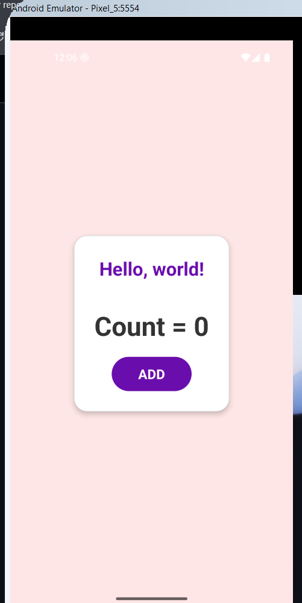

# 🔢 React Native Counter App

A simple **React Native Counter App** with a clean UI and button-based counter.

---

## 📂 Project Structure
react-native-counter-app/  
│── App.js  
│── package.json  
│── img/  
│   └── Count.png *(screenshot of the app)*  

---

## 🖼️ App Preview

<p align="center">
  
</p>

---

## 🚀 Features
- 🟢 Simple & clean UI  
- 📈 Counter using **`useState`**  
- 👆 Button to increment the count  
- 📱 Beginner-friendly React Native project  

---

## 🔧 Technologies Used
- **React Native**
- **JavaScript (ES6+)**
- **React Hooks (`useState`)**

---

## ⚡ How to Run
1. Clone this repository:
   ```bash
   git clone https://github.com/Farri-developer/react-native-counter-app.git
   cd react-native-counter-app
